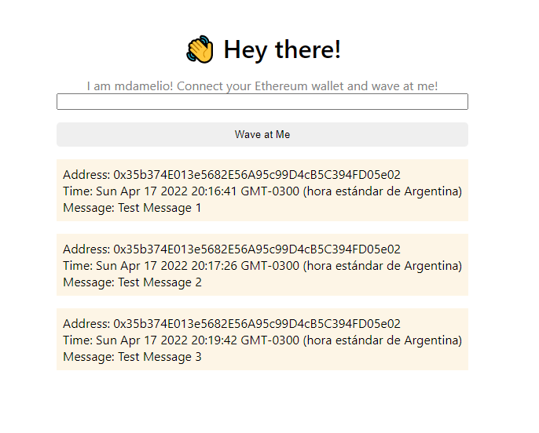

# Wave At Me

Buildspace - First Smart Contract

## Environment Variables

To run this project, you vill need to add the following environment variables to your .env file

`STAGING_ALCHEMY_KEY`

`PRIVATE_KEY`

## Usage

To deploy

```
npx hardhat run scripts/deploy.js --network rinkeby
```

## Dapp

URL Frontend dapp

```
https://waveportal-starter-project.matiasdamelio.repl.co/
```


